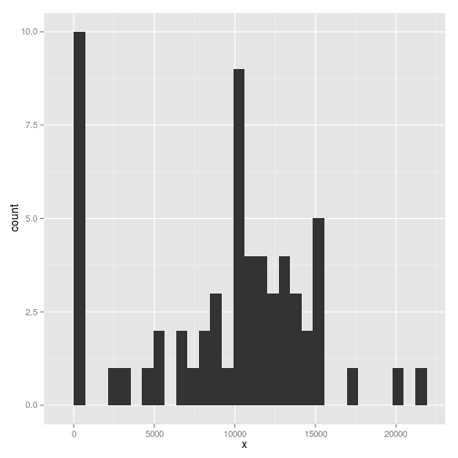
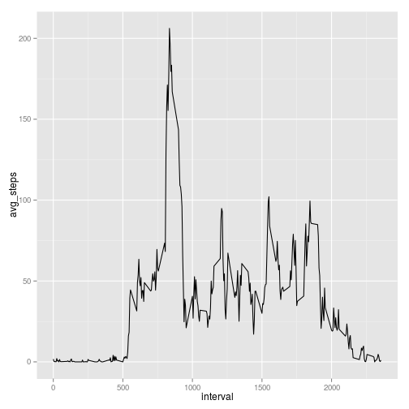
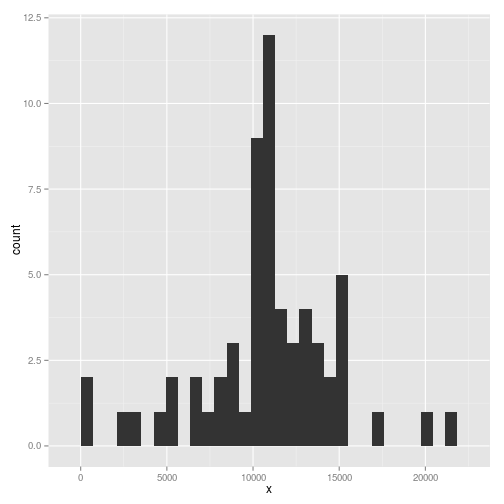
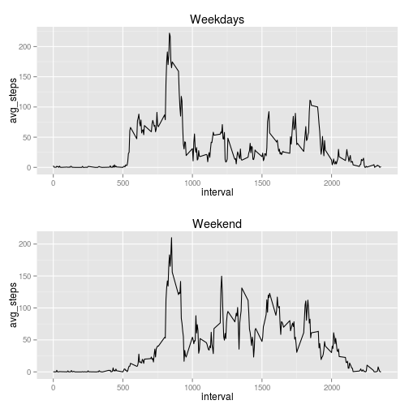

## Loading and preprocessing the data

 - Load the required libraries
 - Load data from the local file *activity.csv*
 - Typecast the data column


```r
library(ggplot2)
library(gridExtra)
options(scipen = 1, digits = 2)

unzip("activity.zip")
d <- read.csv("activity.csv")
d[["date"]] <- as.Date(d[["date"]])
```

## What is mean total number of steps taken per day?

```r
total_per_day <- aggregate(d[, c("steps")], list(d$date), sum, na.rm=TRUE)

total_per_day_mean <- mean(total_per_day$x)
total_per_day_median <- median(total_per_day$x)

qplot(x, data=total_per_day)
```

```
## stat_bin: binwidth defaulted to range/30. Use 'binwidth = x' to adjust this.
```

 

The **mean** of the number of steps taken per day is: *9354.23*.

The **median** of the number of steps taken per day is: *10395*.


## What is the average daily activity pattern?


```r
avg_interval <- aggregate(d[, c("steps")], list(d$interval), mean, na.rm=TRUE)
names(avg_interval) <- c("interval", "avg_steps")
qplot(interval, avg_steps, data=avg_interval, geom="line")
```

 

```r
max_avg_steps <- max(avg_interval$avg_steps)
max_interval <- avg_interval[avg_interval$avg_steps == max_avg_steps,
                             "interval"]
```

The 5-minute interval in which contains the maximum average of steps (206.17 steps) is: *835*.

## Imputing missing values

To smooth the data, the missing values will be replaced with the average of the same interval across all days.


```r
n_na <- sum(is.na(d[["steps"]]))

fix_na <- function (x) {
    if (is.na(x[1]))
        avg_interval[avg_interval$interval == as.numeric(x[3]), "avg_steps"]
    else
        x[1]
    }

d$steps_ <- as.numeric(apply(d, 1, fix_na))

total_per_day_ <- aggregate(d[, c("steps_")], list(d$date), sum, na.rm=TRUE)
total_per_day_mean_ <- mean(total_per_day_$x)
total_per_day_median_ <- median(total_per_day_$x)

qplot(x, data=total_per_day_)
```

```
## stat_bin: binwidth defaulted to range/30. Use 'binwidth = x' to adjust this.
```

 

There are 2304 missing values on the original dataset.

The new **mean** is 10766.19 and the **median** is 10766.19

## Are there differences in activity patterns between weekdays and weekends?


```r
d$weekday <- as.numeric(format(d$date, "%u")) < 5

d_week <- subset(d, d$weekday==TRUE)
d_weekend <- subset(d, d$weekday==FALSE)

avg_interval_week <- aggregate(d_week[, c("steps_")],
                               list(d_week$interval),
                               mean)
avg_interval_weekend <- aggregate(d_weekend[, c("steps_")],
                                  list(d_weekend$interval),
                                  mean)

names(avg_interval_week) <- c("interval", "avg_steps")
plot1 <- qplot(interval, avg_steps, data=avg_interval_week, geom="line")
plot1 <- plot1 + labs(title = "Weekdays")

names(avg_interval_weekend) <- c("interval", "avg_steps")
plot2 <- qplot(interval, avg_steps, data=avg_interval_weekend, geom="line")
plot2 <- plot2 + labs(title = "Weekend")

grid.arrange(plot1, plot2, nrow=2)
```

 
